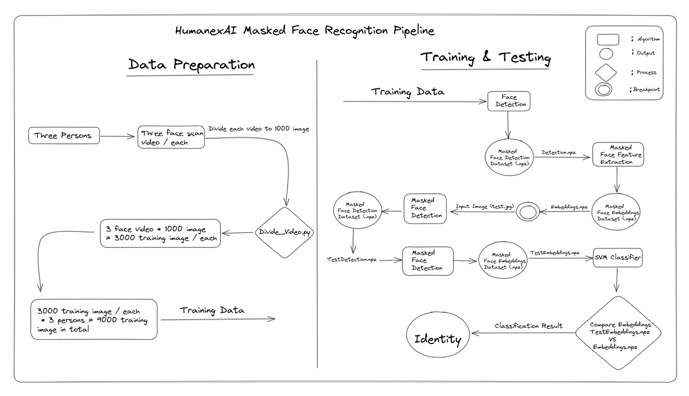

## HumanexAI Masked Face Recognition

This repository contains the source code for a Face Recognition System using MTCNN for face detection, Facenet for feature extraction, and SVM for classification. The system is capable of recognizing the identity of a person even when they are wearing a mask, The project powered by HumanexAI and implemented by Ahmad Jawabreh.

## Introduction

The Face Recognition System is designed to recognize the identity of a person even when they are wearing a mask. The system uses the MTCNN (Multi-task Cascaded Convolutional Networks) algorithm for face detection, which is capable of detecting faces even when they are partially covered by a mask. The Facenet algorithm is used for feature extraction, which extracts a unique set of features from each face that can be used for recognition. Finally, the SVM (Support Vector Machine) algorithm is used for classification, which classifies each face based on the extracted features.

## HumanexAI Masked Face Recognition System Pipeline

In normal face recognition tasks, a small dataset for training is usually sufficient to achieve reasonably good results. However, for masked face recognition, a dataset containing thousands of training samples for each person is required. To address this issue, we asked users for three face scans. Then, using the Divide_Video.py algorithm, we divided each video scan into 1000 images, resulting in a total of 3000 training samples for each person. With this approach, we can guarantee high accuracy in our masked face recognition system.

In our pipeline, after preparing the training and testing data, we start with the face detection algorithm. It takes the training dataset as input and outputs a .npz file. We use this .npz file as input to the feature extraction algorithm, which also outputs a .npz file. Then, we give an input image as a test sample to our SVM classifier. It detects the face, extracts its features, and compares the features of the input image face with the trained features. The below figure illustrating the data preparation process, the training process, and the testing process.



## Use Case
* Survillance Systems 
* Perpetrators Identification 
* Biometric Passport
* Biometric Door Lock Systems


## Dependencies / Requirements
* Python 3.7.x
* Pillow
* matplotlib
* Tensorflow 2.0 or higher
* Scikit-learn 0.22 or higher
* MTCNN 0.1.0 or higher
* Facenet 2.0 or higher
* keras
* keras.models
 

## Installation
1. Clone this repository:
```bash
git clone https://github.com/username/repo-name.git
```

2. Install the required libraries::
```bash
pip install -r requirements.txt
```
3. Prepare your own training dataset

4. Prepare your own testing dataset

5. Run the masked face training algorithm
```python
python RandomTrain.py
```

6. Run the masked face testing algorithm:
```python
python RandomTest.py
```

## Contributing
Contributions are welcome! If you find any issues or bugs, or if you have any suggestions for improving the system, please open an issue or submit a pull request.

## License
This project is licensed under the MIT License.
